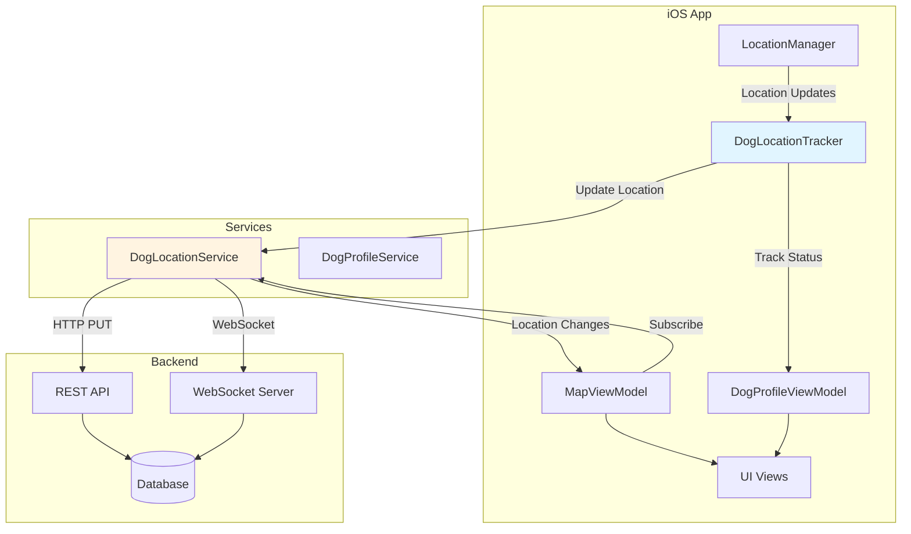
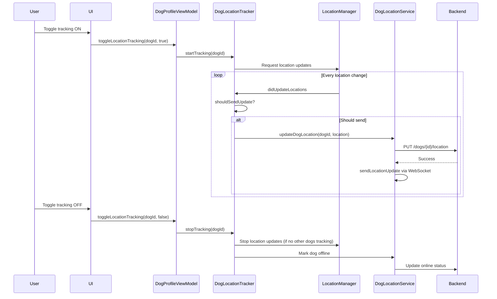

# Design Document: Real-time Dog Location Tracking

## Overview

This feature implements automatic, continuous location tracking for dog profiles in the Creamie app. When enabled, a dog's location will automatically update as the owner moves, allowing other users to see real-time positions on the map. The design leverages iOS CoreLocation framework for location monitoring and integrates with the existing backend API and WebSocket infrastructure for real-time updates.

The system consists of three main components:
1. A location tracking manager that monitors device location changes
2. A location update service that sends updates to the backend
3. Enhanced map view integration that displays real-time location changes

## Architecture

### High-Level Architecture



### Component Responsibilities

**DogLocationTracker** (New Component)
- Manages location tracking state for individual dogs
- Monitors device location changes via LocationManager
- Determines when to send location updates based on distance/time thresholds
- Handles background/foreground transitions
- Manages battery optimization strategies
- Persists tracking preferences

**LocationManager** (Existing, Enhanced)
- Provides device location updates
- Manages location permission requests
- Handles location accuracy and error states
- Supports both foreground and background location updates

**DogLocationService** (Existing, Enhanced)
- Sends location updates to backend via REST API
- Manages WebSocket connection for real-time updates
- Handles retry logic and error recovery
- Queues updates when offline

**DogProfileViewModel** (Existing, Enhanced)
- Stores tracking enabled/disabled state for each dog
- Provides UI bindings for tracking toggle
- Coordinates with DogLocationTracker

**MapViewModel** (Existing, Enhanced)
- Receives real-time location updates via DogLocationService
- Updates dog markers on map
- Handles online/offline status display

## Components and Interfaces

### DogLocationTracker

```swift
@MainActor
class DogLocationTracker: NSObject, ObservableObject {
    // MARK: - Published Properties
    @Published var trackingStatus: [UUID: TrackingStatus] = [:]
    @Published var lastUpdateTime: [UUID: Date] = [:]
    @Published var updateError: Error?
    
    // MARK: - Configuration
    struct TrackingConfig {
        let minimumDistance: CLLocationDistance = 10.0 // meters
        let stationaryUpdateInterval: TimeInterval = 60.0 // seconds
        let movingUpdateInterval: TimeInterval = 5.0 // seconds
        let locationAccuracyThreshold: CLLocationAccuracy = 50.0 // meters
        let stationaryThreshold: TimeInterval = 300.0 // 5 minutes
        let maxRetries: Int = 3
        let retryBackoffBase: TimeInterval = 2.0
        let lowBatteryThreshold: Float = 0.20
    }
    
    // MARK: - Public Interface
    func startTracking(for dogId: UUID)
    func stopTracking(for dogId: UUID)
    func stopAllTracking()
    func isTracking(dogId: UUID) -> Bool
    func getTrackingStatus(for dogId: UUID) -> TrackingStatus?
    
    // MARK: - Private Methods
    private func handleLocationUpdate(_ location: CLLocation)
    private func shouldSendUpdate(for dogId: UUID, location: CLLocation) -> Bool
    private func sendLocationUpdate(dogId: UUID, location: CLLocation) async
    private func handleBackgroundTransition()
    private func handleForegroundTransition()
    private func isDeviceStationary() -> Bool
    private func adjustForBatteryLevel()
}

enum TrackingStatus: Equatable {
    case active
    case paused
    case stopped
    case error(String)
}
```

### Enhanced Dog Model

```swift
extension Dog {
    var isLocationTrackingEnabled: Bool { get set }
    var lastLocationUpdate: Date? { get set }
}
```

### Enhanced DogProfileViewModel

```swift
extension DogProfileViewModel {
    @Published var locationTracker: DogLocationTracker
    
    func toggleLocationTracking(for dogId: UUID, enabled: Bool) async
    func getLocationTrackingStatus(for dogId: UUID) -> TrackingStatus?
    func isLocationTrackingEnabled(for dogId: UUID) -> Bool
}
```

### Enhanced LocationManager

```swift
extension LocationManager {
    func requestAlwaysAuthorization()
    func startSignificantLocationChangeMonitoring()
    func stopSignificantLocationChangeMonitoring()
    var allowsBackgroundLocationUpdates: Bool { get set }
}
```

### Location Update Flow



## Data Models

### TrackingPreferences (Persisted)

```swift
struct TrackingPreferences: Codable {
    let dogId: UUID
    let isEnabled: Bool
    let lastKnownLocation: CLLocationCoordinate2D?
    let lastUpdateTime: Date?
}
```

Stored in UserDefaults with key: `"dog_location_tracking_preferences"`

### LocationUpdateRequest (API)

```swift
struct LocationUpdateRequest: Codable {
    let dogId: UUID
    let latitude: Double
    let longitude: Double
    let timestamp: Date
    let accuracy: Double
}
```

### Backend API Endpoints

**Update Dog Location**
- Endpoint: `PUT /dogs/{dogId}/location`
- Request Body: `LocationUpdateRequest`
- Response: `EmptyResponse` or error

**Update Online Status**
- Endpoint: `POST /dogs/update-online-status`
- Request Body: `UpdateDogOnlineStatusRequest`
- Response: `UpdateDogOnlineStatusResponse`

### UserDefaults Storage

```swift
class TrackingPreferencesStore {
    private let key = "dog_location_tracking_preferences"
    
    func savePreference(_ preference: TrackingPreferences)
    func loadPreference(for dogId: UUID) -> TrackingPreferences?
    func loadAllPreferences() -> [TrackingPreferences]
    func deletePreference(for dogId: UUID)
}
```


## Correctness Properties

A property is a characteristic or behavior that should hold true across all valid executions of a system—essentially, a formal statement about what the system should do. Properties serve as the bridge between human-readable specifications and machine-verifiable correctness guarantees.

### Property Reflection

After analyzing all acceptance criteria, several properties were identified as redundant or combinable:
- Property 1.2 and 4.3 both test the same behavior (10-meter threshold for updates) - combined into Property 2
- Properties about UI timing (3.1, 3.2) focus on the core behavior rather than specific timing thresholds
- Properties 2.2 and 2.3 can be combined into a single toggle property
- Properties about background/foreground modes (1.4, 1.5, 4.1) can be combined into mode-switching properties

### Core Properties

**Property 1: Tracking activation starts monitoring**
*For any* dog profile, when location tracking is enabled, the Location_Tracker should begin actively monitoring device location.
**Validates: Requirements 1.1, 2.2**

**Property 2: Distance threshold triggers updates**
*For any* sequence of location updates for a tracked dog, when consecutive locations differ by more than 10 meters, a location update should be sent to the backend.
**Validates: Requirements 1.2, 4.3**

**Property 3: Location updates contain required fields**
*For any* location update sent to the backend, the update should include dog ID, latitude, longitude, timestamp, and accuracy.
**Validates: Requirements 1.3**

**Property 4: Background mode uses reduced frequency**
*For any* tracked dog, when the app transitions to background, the Location_Tracker should switch to significant location change monitoring.
**Validates: Requirements 1.4, 4.1**

**Property 5: Foreground mode uses high accuracy**
*For any* tracked dog, when the app is in foreground, the Location_Tracker should use high accuracy location monitoring.
**Validates: Requirements 1.5**

**Property 6: Profile displays tracking status**
*For any* dog profile, the displayed tracking status should match the actual tracking state in the Location_Tracker.
**Validates: Requirements 2.1, 6.4**

**Property 7: Tracking deactivation stops monitoring and marks offline**
*For any* dog profile, when location tracking is disabled, the Location_Tracker should stop monitoring for that dog and the backend should mark the dog as offline.
**Validates: Requirements 2.3, 2.4**

**Property 8: Tracking preferences persist across restarts**
*For any* set of dogs with various tracking states, terminating and restarting the app should preserve the tracking enabled/disabled state for each dog.
**Validates: Requirements 2.5, 7.5**

**Property 9: Map updates reflect location changes**
*For any* dog whose location is updated on the backend, the Map_View should reflect the new location.
**Validates: Requirements 3.1**

**Property 10: Offline dogs are removed from map**
*For any* dog that goes offline, the Map_View should remove or visually distinguish the dog's marker.
**Validates: Requirements 3.2**

**Property 11: Online dogs appear on map**
*For any* dog that comes online, the Map_View should display the dog's marker at their current location.
**Validates: Requirements 3.3**

**Property 12: Independent dog location updates**
*For any* set of dogs being tracked simultaneously, location updates for one dog should not interfere with or block updates for other dogs.
**Validates: Requirements 3.4**

**Property 13: Stationary detection reduces frequency**
*For any* tracked dog, when the device remains stationary for more than 5 minutes, the update frequency should reduce to once per minute.
**Validates: Requirements 4.2**

**Property 14: Low battery triggers power saving**
*For any* tracked dog, when battery level drops below 20%, the Location_Tracker should automatically switch to low-power mode.
**Validates: Requirements 4.4**

**Property 15: Accuracy filtering**
*For any* location reading with accuracy worse than 50 meters, the Location_Tracker should reject it and not send an update.
**Validates: Requirements 5.1, 5.2**

**Property 16: Last known location fallback**
*For any* tracked dog, when GPS signal is unavailable, the system should use the last known good location with its original timestamp.
**Validates: Requirements 5.3**

**Property 17: Independent tracking per dog**
*For any* owner with multiple dogs, each dog should have independently controllable tracking state.
**Validates: Requirements 6.1, 6.3**

**Property 18: Multi-dog simultaneous updates**
*For any* set of dogs with tracking enabled, location updates should be sent for all enabled dogs when location changes.
**Validates: Requirements 6.2**

**Property 19: Retry with exponential backoff**
*For any* failed location update, the system should retry up to 3 times with exponential backoff (2^n seconds).
**Validates: Requirements 7.1**

**Property 20: Offline queuing and replay**
*For any* location updates that occur while offline, the updates should be queued and sent when connectivity is restored.
**Validates: Requirements 7.2**

**Property 21: Error resilience**
*For any* backend error during location update, the Location_Tracker should continue tracking and not stop.
**Validates: Requirements 7.3**

**Property 22: Permission revocation handling**
*For any* tracked dog, when location permissions are revoked, the Location_Tracker should stop tracking gracefully and notify the owner.
**Validates: Requirements 7.4**

## Error Handling

### Location Permission Errors
- **Denied**: Display alert prompting user to enable location permissions in Settings
- **Restricted**: Display message that location services are restricted by device policy
- **Not Determined**: Automatically request permission when tracking is enabled

### Network Errors
- **Connection Lost**: Queue updates locally, retry when connection restored
- **Timeout**: Retry with exponential backoff (max 3 attempts)
- **Server Error (5xx)**: Log error, continue tracking, retry next update
- **Client Error (4xx)**: Log error, stop retrying, notify user if persistent

### Location Accuracy Errors
- **Poor Accuracy (>50m)**: Wait for better reading, don't send update
- **No GPS Signal**: Use last known location, mark with timestamp
- **Stale Location**: Don't send updates older than 5 minutes

### Battery and Performance
- **Low Battery (<20%)**: Automatically switch to low-power mode
- **Background Mode**: Use significant location changes only
- **App Termination**: Persist tracking state, resume on restart

### Multi-Dog Scenarios
- **Partial Failure**: If update fails for one dog, continue updating others
- **Conflicting States**: Each dog maintains independent tracking state
- **Resource Limits**: Limit to tracking 5 dogs simultaneously

## Testing Strategy

### Dual Testing Approach

This feature will use both unit tests and property-based tests to ensure comprehensive coverage:

**Unit Tests** will verify:
- Specific examples of location updates
- Edge cases (exactly 10 meters, exactly 50 meters accuracy)
- Error conditions (permission denied, network failure)
- State transitions (foreground to background)
- Integration between components

**Property-Based Tests** will verify:
- Universal properties hold across all inputs
- Location sequences with random distances
- Random sets of dogs with various tracking states
- Random battery levels and app states
- Concurrent updates for multiple dogs

Both testing approaches are complementary and necessary for comprehensive coverage. Unit tests catch concrete bugs in specific scenarios, while property tests verify general correctness across the input space.

### Property-Based Testing Configuration

We will use Swift's built-in testing framework along with a property-based testing library for Swift (such as SwiftCheck or swift-check). Each property test will:
- Run a minimum of 100 iterations with randomized inputs
- Be tagged with a comment referencing the design property
- Tag format: `// Feature: real-time-dog-location-tracking, Property N: [property text]`

### Test Organization

```
CreamieTests/
├── LocationTracking/
│   ├── DogLocationTrackerTests.swift (unit tests)
│   ├── DogLocationTrackerPropertyTests.swift (property tests)
│   ├── LocationUpdateServiceTests.swift (unit tests)
│   ├── TrackingPreferencesStoreTests.swift (unit tests)
│   └── IntegrationTests.swift (end-to-end scenarios)
```

### Key Test Scenarios

**Unit Test Examples:**
- Test that enabling tracking for a dog starts location monitoring
- Test that 10-meter threshold triggers update
- Test that background mode switches to significant location changes
- Test that low battery triggers power saving mode
- Test retry logic with mocked network failures

**Property Test Examples:**
- For all location sequences, verify distance threshold behavior
- For all sets of dogs, verify independent tracking
- For all app state transitions, verify correct monitoring mode
- For all battery levels, verify appropriate power mode
- For all network failure scenarios, verify retry behavior

### Mocking Strategy

- Mock `CLLocationManager` for location updates
- Mock `DogLocationService` for backend communication
- Mock `UserDefaults` for preference persistence
- Use dependency injection for testability
- Create test doubles for WebSocket connections

### Integration Testing

- Test full flow: enable tracking → location change → backend update → map display
- Test multi-dog scenarios with real state management
- Test app lifecycle: background → foreground → terminate → restart
- Test network transitions: online → offline → online
- Test permission changes during active tracking
